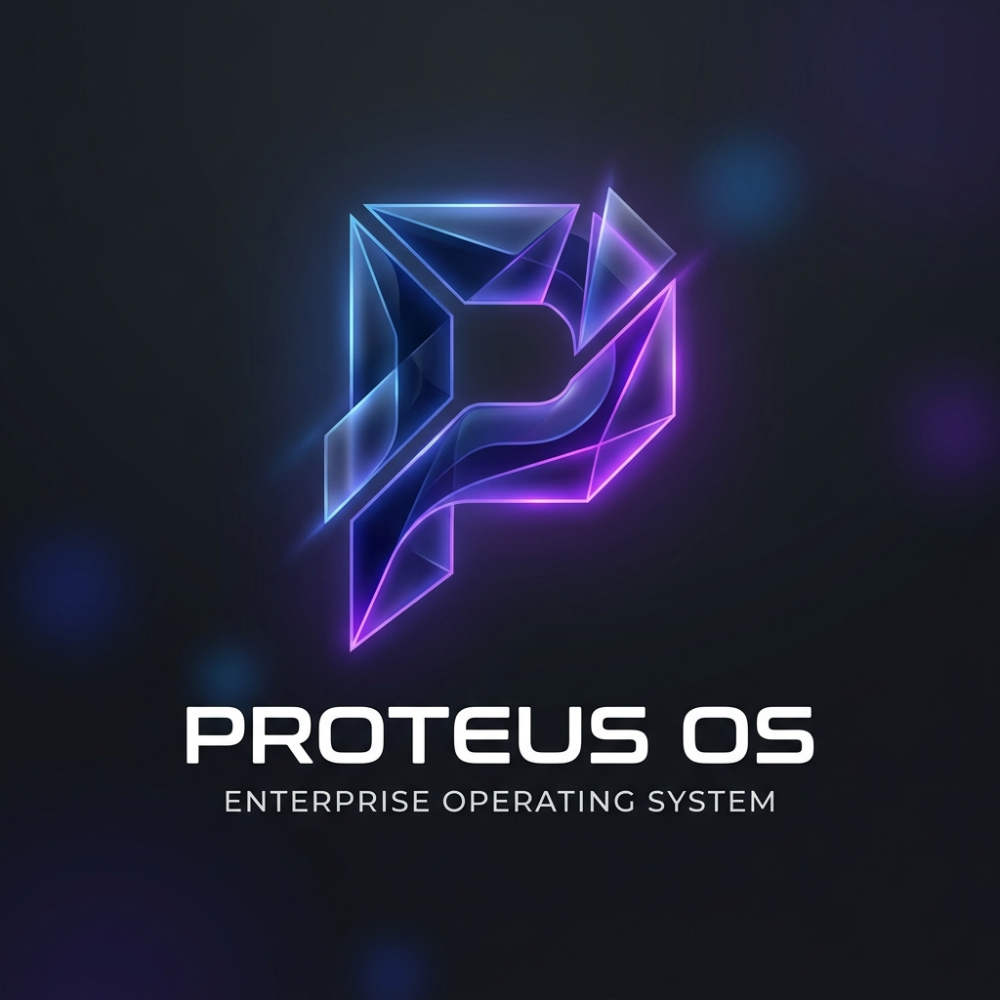

<div align="center">
  
  
  <h1>Proteus OS</h1>
  <p><b>Hệ điều hành Đa năng (Universal OS) Thế hệ mới</b></p>
  <p><i>Linux là hệ điều hành cho máy tính. Proteus OS là hệ điều hành lõi cho mọi tổ chức (Doanh nghiệp, Trường học, Y tế,...).</i></p>

  [](./LICENSE)
  []()
  []()
</div>

---

## 🌟 Tầm nhìn & Sứ mệnh

**Proteus OS** không chỉ là một phần mềm quản trị thông thường, mà là một **Hệ điều hành Đa năng (Universal OS)**. Với kiến trúc Lõi (Core) kết hợp linh hoạt cùng Chợ ứng dụng (Plugin Marketplace), hệ thống có thể biến hóa để giải quyết triệt để "nỗi đau" của bất kỳ tổ chức nào (từ Doanh nghiệp SME, Trường học cho đến Bệnh viện) bằng cách đập bỏ "ốc đảo thông tin", tự động hóa quy trình (Workflow) và nhúng Trí tuệ Nhân tạo (Agentic AI) vào mọi ngóc ngách của quá trình vận hành.

Dự án được xây dựng dựa trên sự kết hợp hoàn hảo giữa các nền tảng **Open-Source** hàng đầu thế giới và **Innovation Layer** (Core Engine) tự phát triển với kiến trúc Micro-Kernel hiện đại.

## 📚 Hệ thống Tài liệu (Documentation)

Toàn bộ tài liệu đặc tả, thiết kế kiến trúc và giao diện được lưu trữ công khai trong thư mục `/docs`. Vui lòng đọc kỹ trước khi đóng góp code:

- 📄 **[Tài liệu Đặc tả Yêu cầu (BRD)](./docs/BRD.md):** Tầm nhìn, chức năng và rào chắn kỹ thuật (NFR).
- 🏗️ **[Thiết kế Kiến trúc Tổng thể (SAD)](./docs/architecture.md):** Phân tích kiến trúc Hexagonal (Backend), Custom Hooks (Frontend), SSO flow bảo mật và ADR chốt Redis Event Bus.
- 🎨 **[Thiết kế Giao diện (UI/UX)](./docs/ui_ux_design.md):** Phác thảo giao diện Launchpad & App Store theo phong cách Glassmorphism.
- 🗄️ **[Lược đồ Dữ liệu (Core ERD)](./docs/erd.md):** Sơ đồ quan hệ các bảng lõi, triển khai RLS và chiến lược Migration.
- 🔐 **[Làm rõ Đa khách hàng & Phân quyền](./docs/clarification.md):** Multi-Tenancy, RBAC, Keycloak sync flow, Metabase OSS embedding và Human-in-the-loop AI.
- 🔌 **[Tài liệu API (OpenAPI/Swagger)](./docs/api-swagger.yaml):** Đặc tả 18+ Endpoint của Core Engine, đầy đủ error schemas.
- 🤖 **[Đặc tả AI DSL (DX-DSL Spec)](./docs/dsl-spec.md):** Cấu trúc JSON chuẩn, whitelist action, effect levels và validation rules cho AI Orchestrator.
- 🚀 **[Hướng dẫn Triển khai (Deployment Guide)](./docs/deployment.md):** Kiến trúc mạng, Traefik routing, Observability Stack (Loki) và chiến lược Backup.

## 🚀 Hướng dẫn Cài đặt (Quick Start)

Dự án yêu cầu môi trường **Docker** và **Docker Compose** để chạy.

> [!NOTE]
> **Hai chế độ truy cập:**
> - **Development (local):** Truy cập trực tiếp qua port (hướng dẫn bên dưới). Dùng để dev nhanh, không cần cấu hình domain.
> - **Production/Staging:** Toàn bộ traffic đi qua **Traefik Proxy** tại domain `proteus.local` (hoặc domain thật). Xem chi tiết tại [Deployment Guide](./docs/deployment.md).

1. **Clone mã nguồn:**
   ```bash
   git clone https://github.com/CuongKenn/ICTU_Proteus-os.git
   cd ICTU_Proteus-os
   ```

2. **Chạy Script Cài đặt Tự động:**
   *(Lưu ý: Môi trường triển khai Production cần cấu hình lại các file biến môi trường `.env`)*
   ```bash
   cd deploy
   ./setup.sh
   ```

3. **Truy cập Hệ thống (Development — truy cập trực tiếp):**
   - Launchpad (Next.js): `http://localhost:3000`
   - API Docs (Swagger): `http://localhost:8000/docs`
   - Keycloak Admin: `http://localhost:8080`

   **Truy cập Hệ thống (Production — qua Traefik):**
   - Launchpad: `https://proteus.local/`
   - API: `https://proteus.local/api/`
   - Keycloak: `https://proteus.local/auth/`
   - Mattermost Chat: `https://proteus.local/chat/`
   - Grafana Monitoring: `https://proteus.local/monitoring/`

## 🏗️ Ngăn xếp Công nghệ (Tech Stack)

- **Lõi Hệ điều hành (Core Engine - Innovation Layer):** 
  - Frontend: `Next.js` (React), `Zustand`, `TailwindCSS`
  - Backend: `FastAPI` (Python), `SQLAlchemy`, `LangChain`
- **Hệ sinh thái Mã nguồn mở (Ecosystem):**
  - Identity & Auth: `Keycloak`
  - Workflow Automation: `n8n`
  - Low-code UI: `Appsmith`
  - BI & Reports: `Metabase`
  - Database: `PostgreSQL`, `Qdrant` (Vector DB)
  - Communication: `Mattermost`
  - Knowledge Base: `Outline`, `Nextcloud`

## 🤝 Đóng góp (Contributing)
Mọi đóng góp (Pull Request, Báo lỗi - Issue) đều được hoan nghênh. Vui lòng đọc kỹ bộ tài liệu trong thư mục `docs/` để nắm rõ triết lý thiết kế trước khi gửi mã nguồn.

## 📜 Giấy phép (License)
Dự án được phân phối dưới giấy phép **GNU AGPLv3**. Vui lòng xem tệp [LICENSE](./LICENSE) để biết thêm chi tiết.
