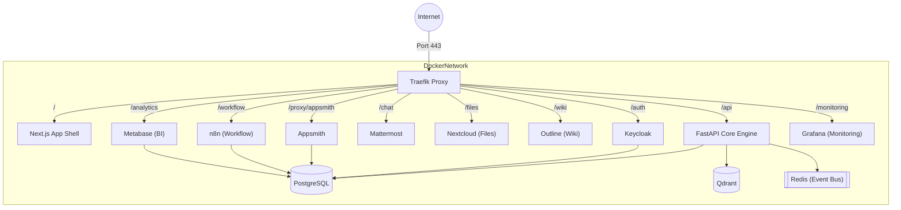
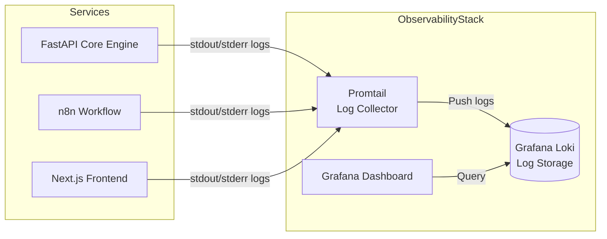

# Hướng dẫn Triển khai & Cấu hình Hạ tầng (Deployment Guide)

Tài liệu này mô tả chi tiết cách thức triển khai toàn bộ hệ sinh thái **Proteus OS** sử dụng Docker Compose, cơ chế định tuyến (Routing) qua Traefik, và các yêu cầu về phần cứng (Hardware Requirements).

---

## 1. Yêu cầu Cấu hình Phần cứng (Hardware Requirements)

Vì Proteus OS là một hệ sinh thái khổng lồ chạy nhiều dịch vụ cùng lúc (Keycloak, Mattermost, n8n, Appsmith, PostgreSQL, v.v.), việc cấp phát tài nguyên đầy đủ là bắt buộc để hệ thống không bị crash do thiếu RAM.

### 1.1. Cấu hình Khuyến nghị (Production/Staging)
Dành cho một tổ chức quy mô vừa (khoảng 100 - 500 nhân sự):
- **CPU:** Tối thiểu 8 Cores (Khuyến nghị 16 Cores)
- **RAM:** Tối thiểu 16GB (Khuyến nghị 32GB)
- **Storage:** Tối thiểu 100GB NVMe SSD (để đảm bảo tốc độ đọc/ghi cho Database và RAG/Vector DB)
- **OS:** Ubuntu 22.04 LTS hoặc 24.04 LTS

### 1.2. Cấu hình Môi trường Phát triển (Local/Development)
Dành cho lập trình viên chạy thử nghiệm (có thể tắt bớt một số dịch vụ không cần thiết):
- **CPU:** 4 Cores
- **RAM:** Tối thiểu 12GB
- Tăng cấu hình cấp phát (Resource Limits) cho Docker Desktop nếu sử dụng Windows/Mac.

---

## 2. Kiến trúc Mạng & Định tuyến (Network & Routing)

### 2.1. Traefik Proxy - Trái tim của Hệ thống Mạng
Để giải quyết bài toán giao tiếp giữa các dịch vụ, nhúng Iframe an toàn (vượt rào cản SameSite Cookie), và cung cấp HTTPS tự động, Proteus OS sử dụng **Traefik Proxy** làm cửa ngõ duy nhất (Edge Router).

*   **Ports:** Traefik là dịch vụ duy nhất được phép "mở" cổng (Bind) ra bên ngoài tại Port `80` (HTTP) và `443` (HTTPS). Tất cả các dịch vụ khác (Keycloak, n8n, Appsmith) chỉ giao tiếp nội bộ trong Docker Network.
*   **Single-Domain Path-Based Routing:** Để các ứng dụng có thể chia sẻ Cookie bảo mật với nhau (đặc biệt quan trọng cho Single Sign-On và Iframe), toàn bộ hệ thống chạy trên **CÙNG MỘT TÊN MIỀN GỐC** (Ví dụ: `proteus.local`). Traefik sẽ định tuyến dựa vào Path (đường dẫn):
    - `https://proteus.local/` 👉 Chuyển về **Next.js App Shell (Launchpad)**
    - `https://proteus.local/api/` 👉 Chuyển về **FastAPI Core Engine**
    - `https://proteus.local/auth/` 👉 Chuyển về **Keycloak**
    - `https://proteus.local/chat/` 👉 Chuyển về **Mattermost**
    - `https://proteus.local/files/` 👉 Chuyển về **Nextcloud** (lưu trữ file)
    - `https://proteus.local/wiki/` 👉 Chuyển về **Outline** (Wiki/CMS)
    - `https://proteus.local/workflow/` 👉 Chuyển về **n8n** (Workflow Admin UI)
    - `https://proteus.local/analytics/` 👉 Chuyển về **Metabase** (BI Dashboard)
    - `https://proteus.local/proxy/appsmith/` 👉 Chuyển về **Appsmith** (Để nhúng Iframe)
    - `https://proteus.local/monitoring/` 👉 Chuyển về **Grafana** (Log Observability)

### 2.2. Sơ đồ Mạng (Docker Network Diagram)



---

## 3. Cấu hình Khởi chạy (1-Click Deployment)

Dự án cung cấp một file `setup.sh` để tự động hóa toàn bộ quá trình thiết lập.

### Bước 1: Khởi tạo biến môi trường
Tạo file `.env` từ file mẫu:
```bash
cp deploy/.env.example deploy/.env
```
*(Chỉnh sửa các mật khẩu và thiết lập tên miền `DOMAIN=proteus.local` trong file `.env`)*

### Bước 2: Khởi chạy hệ thống
Chạy script tự động thiết lập quyền (permissions), khởi tạo thư mục mount và bật Docker Compose:
```bash
cd deploy
bash setup.sh
```

### Bước 3: Cấu hình Local DNS (Dành cho Development)
Nếu chạy ở môi trường Local (chưa có tên miền thật), bạn cần trỏ tên miền ảo về `localhost` bằng cách sửa file `/etc/hosts` (trên Linux/Mac) hoặc `C:\Windows\System32\drivers\etc\hosts` (trên Windows):
```text
127.0.0.1 proteus.local
```

### Bước 4: Kiểm tra trạng thái
Kiểm tra xem tất cả các container đã `Up` và trạng thái `Healthy` chưa:
```bash
docker-compose ps
```

---

## 4. Bảo mật & Quản lý Dữ liệu (Volumes)

- **Persistent Volumes:** Tất cả dữ liệu quan trọng (PostgreSQL data, Qdrant vectors, Mattermost files, Nextcloud data) đều được map ra ngoài thư mục vật lý thông qua Docker Volumes để đảm bảo dữ liệu không bị mất khi khởi động lại container.
- **SSL/TLS:** Mặc định, Traefik được cấu hình sử dụng Let's Encrypt (DNS Challenge) để tự động cấp phát và gia hạn chứng chỉ SSL, đảm bảo mọi giao tiếp đều mã hóa qua HTTPS.

---

## 5. Hệ thống Ghi Log Tập trung (Observability Stack)

Để đáp ứng NFR5, Proteus OS sử dụng **Grafana Loki + Promtail** (nhẹ hơn ELK Stack, phù hợp với Docker Compose) để thu thập và trực quan hóa log.

### 5.1. Kiến trúc Logging



### 5.2. Các nhóm Log quan trọng cần theo dõi

| Log Label | Nội dung | Mức độ |
|---|---|---|
| `job=plugin-manager` | Tiến trình cài đặt Plugin (từng bước) | INFO / ERROR |
| `job=ai-orchestrator` | Lệnh AI nhận được, DSL tạo ra, kết quả | INFO / WARN |
| `job=auth-middleware` | Lỗi xác thực JWT, tenant không tồn tại | WARN / ERROR |
| `job=rls-guard` | Attempt truy cập sai tenant_id | ERROR / CRITICAL |
| `job=cleanup-agent` | Kết quả dọn dẹp FAILED_DIRTY plugins | INFO / ERROR |

### 5.3. Truy cập Grafana

Sau khi hệ thống khởi động, truy cập Grafana tại `https://proteus.local/monitoring/` với thông tin đăng nhập mặc định trong file `.env`.

---

## 6. Sao lưu & Phục hồi (Backup & Recovery)

Để đáp ứng NFR6 và đảm bảo Business Continuity:

### 6.1. Chiến lược Sao lưu

- **PostgreSQL:** Cronjob tự động `pg_dump` mỗi ngày lúc 2:00 AM, lưu vào volume `./backups/postgres/`. Giữ lại 30 bản gần nhất.
- **Qdrant Vector DB:** Sao lưu snapshot mỗi tuần (dữ liệu vector có thể rebuild lại từ tài liệu gốc nếu cần).
- **Nextcloud Files:** Rsync hàng đêm sang storage phụ (có thể là S3-compatible như MinIO).
- **Mattermost:** Export message history theo tháng.

### 6.2. Kiểm tra Phục hồi

Định kỳ 3 tháng/lần, Admin phải thực hiện **Disaster Recovery Test**:
1. Dừng toàn bộ hệ thống.
2. Khởi tạo lại từ bản backup mới nhất.
3. Xác nhận dữ liệu nguyên vẹn.
4. Ghi chép RTO (Recovery Time Objective) và RPO (Recovery Point Objective) đạt được.

---

## 7. AI Services — Yêu cầu Hạ tầng

AI là tính năng tiêu thụ tài nguyên đáng kể nhất. Cần lưu ý khi deploy.

### 7.1. Các dịch vụ phục vụ AI

| Service | Vai trò | Ghi chú Tài nguyên |
|---|---|---|
| **Qdrant** | Vector DB lưu trữ embedding tài liệu (RAG) | Cần ít nhất 2GB RAM. Dữ liệu persist tại `./data/qdrant` |
| **Redis** | Event Bus — AI Monitor subscribe event từ các Plugin | RAM phụ thuộc vào throughput event |
| **n8n** | Chạy Proactive Monitor Agent (Cron Workflow) | Cần kết nối với PostgreSQL và Mattermost |
| **LangChain (Core Engine)** | Phân tích ngôn ngữ tự nhiên, tạo DX-DSL | Chạy trong container FastAPI, gọi API LLM ngoài |

### 7.2. LLM Provider (External API)

AI Orchestrator gọi ra một LLM provider bên ngoài. Cần cấu hình trong `.env`:

```env
# Chọn một trong các provider sau:
OPENAI_API_KEY=sk-...              # OpenAI GPT-4o
GEMINI_API_KEY=AIza...             # Google Gemini Pro
ANTHROPIC_API_KEY=sk-ant-...       # Anthropic Claude

# Model để dùng
LLM_MODEL=gpt-4o                   # Hoặc gemini-1.5-pro, claude-3-5-sonnet
LLM_TEMPERATURE=0.1                # Thấp để giảm hallucination trong tác vụ thực thi
```

> [!WARNING]
> **Chi phí:** Mỗi lệnh AI gửi đến LLM đều tốn token. Cần monitor usage và đặt budget alert tại provider. Tính năng RAG (Proactive Monitor, Q&A) có thể tốn nhiều token hơn dự kiến nếu không giới hạn context size.

### 7.3. Proactive Monitor — Cấu hình Lịch chạy

Monitor Agent chạy theo Cron qua n8n. Chỉnh lịch trong `n8n` UI:

| Job | Schedule mặc định | Mô tả |
|---|---|---|
| Quét đơn quá hạn | `*/30 * * * *` | Mỗi 30 phút kiểm tra workflow bị kẹt |
| Phân tích bất thường | `0 7 * * *` | 7h sáng mỗi ngày, gửi báo cáo sáng |
| Sync tài liệu RAG | `0 2 * * *` | 2h sáng hàng đêm, index tài liệu mới từ Nextcloud |

> **Hiểu rõ hơn về những gì AI có thể làm và không thể làm trong hệ thống:** xem [`docs/clarification.md §9`](./clarification.md).


