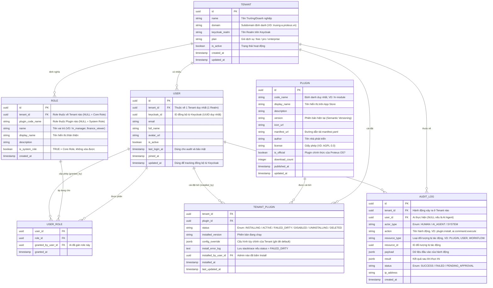
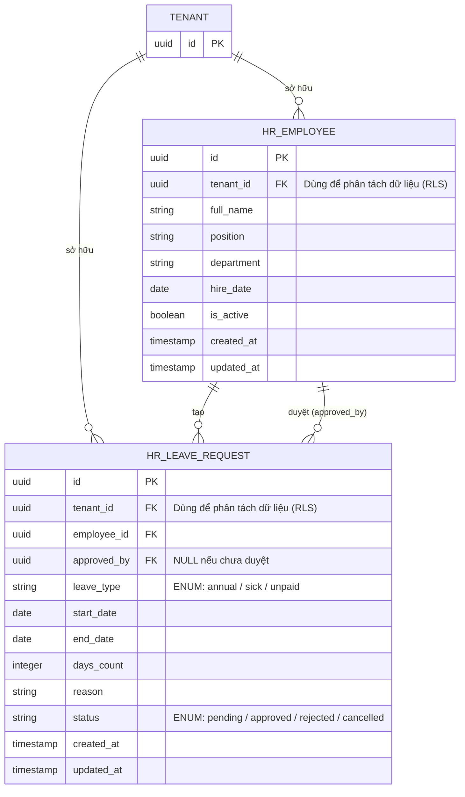

# Lược đồ Dữ liệu Cốt lõi (Core ERD) - Proteus OS

Tài liệu này mô tả Lược đồ Thực thể Liên kết (Entity Relationship Diagram - ERD) cho phần **Proteus OS Base** (Phần lõi hệ điều hành).

Cơ sở dữ liệu này (PostgreSQL) không chứa dữ liệu nghiệp vụ của từng phòng ban (như bảng Chấm công, Hóa đơn). Thay vào đó, nó quản lý lớp **Siêu dữ liệu (Metadata)** bao gồm: Đa khách hàng (Tenants), Người dùng (Users), Phân quyền (Roles) và Quản lý Ứng dụng (Plugins). Dữ liệu nghiệp vụ sẽ do các file `seed_data.sql` của từng Plugin tự tạo bảng riêng rẽ khi được cài đặt.

## 1. Sơ đồ Thực thể (Mermaid Diagram)

Dưới đây là sơ đồ kiến trúc các bảng lõi của hệ thống:



---

## 2. Diễn giải các Bảng (Tables Description)

### 2.1. Nhóm Quản lý Đa khách hàng & Người dùng (Multi-Tenancy & Identity)

- **Bảng `TENANT`:** Trái tim của kiến trúc Multi-Tenancy. Mỗi khách hàng mua SaaS sẽ có một bản ghi ở đây. Cột `keycloak_realm` dùng để trỏ tới vách ngăn tương ứng bên trong Keycloak. Cột `plan` xác định giới hạn tính năng (freemium model).
- **Bảng `USER`:** Lưu trữ thông tin cơ bản của người dùng. Mỗi User chỉ thuộc về 1 Tenant duy nhất để đồng nhất với cơ chế cách ly Realm của Keycloak. Mật khẩu **không được lưu ở đây** mà do Keycloak quản lý. Cột `keycloak_id` dùng làm cầu nối để đồng bộ trạng thái khi đăng nhập (SSO). Cột `updated_at` dùng để phát hiện khi Keycloak gửi User-Updated event.

### 2.2. Nhóm Quản lý Phân quyền (RBAC - Role-Based Access Control)

- **Bảng `ROLE`:** Danh mục các Vai trò. Điểm quan trọng:
  - `tenant_id = NULL` và `plugin_code_name = NULL` → **Platform Core Role** (superadmin, platform_support) — quản lý toàn bộ hệ thống.
  - `tenant_id = <id>` và `plugin_code_name = NULL` → **Tenant Admin Role** (tenant_admin, tenant_manager) — quản trị trong phạm vi tổ chức.
  - `tenant_id = <id>` và `plugin_code_name != NULL` → **Plugin Role** tự động tạo khi Plugin được cài đặt (VD: `hr_manager`, `leave_approver`).
  
  | Role | tenant_id | plugin_code_name | Quyền cài Plugin |
  |---|---|---|---|
  | `superadmin` | NULL | NULL | ✅ Tất cả Tenant |
  | `tenant_admin` | \<id\> | NULL | ✅ Chỉ Tenant mình |
  | `hr_manager` | \<id\> | `hr-module` | ❌ Không |

- **Bảng `USER_ROLE`:** Xác định cụ thể người dùng có vai trò gì trong hệ thống. Cột `granted_by_user_id` đảm bảo mọi thay đổi phân quyền đều có người chịu trách nhiệm (accountability).

### 2.3. Nhóm Quản lý Chợ Ứng dụng (Marketplace)

- **Bảng `PLUGIN`:** Chứa danh sách các gói mở rộng hiện có trên App Store của Proteus OS (như HR, Finance, CRM).
- **Bảng `TENANT_PLUGIN`:** Ghi nhận tổ chức nào đã cài ứng dụng nào. Khi truy cập Launchpad, Frontend (Next.js) sẽ `SELECT` từ bảng này để vẽ ra màn hình các Icon ứng dụng. Trạng thái `status` quan trọng:

  | Status | Ý nghĩa |
  |---|---|
  | `INSTALLING` | Đang chạy provisioning (tạo DB, nạp n8n, Metabase) |
  | `ACTIVE` | Đã cài đặt thành công, sẵn sàng sử dụng |
  | `FAILED_DIRTY` | Cài đặt thất bại giữa chừng, có dữ liệu rác. Cleanup Agent sẽ xử lý |
  | `DISABLED` | Admin tắt tạm thời nhưng chưa gỡ |
  | `UNINSTALLING` | Đang gỡ cài đặt (Compensating Transaction) |
  | `DELETED` | Đã gỡ hoàn toàn |

### 2.4. Nhóm Kiểm toán & Bảo mật (Audit Trail)

- **Bảng `AUDIT_LOG`:** Ghi lại mọi hành động quan trọng trong hệ thống. Đây là yêu cầu bắt buộc cho hệ thống Enterprise, đặc biệt khi AI Agent có quyền thực thi lệnh thay mặt người dùng. Cột `actor_type` xác định nguồn hành động:
  - `HUMAN`: Người dùng thực hiện trực tiếp qua UI.
  - `AI_AGENT`: AI thực hiện sau khi được phê duyệt qua Human-in-the-loop. `user_id` lúc này = NULL, nhưng `payload` chứa `command_id` của DSL Command để trace lại.
  - `SYSTEM`: Hệ thống tự động thực hiện (VD: Cleanup Agent xóa dữ liệu rác `FAILED_DIRTY`).
  
  Bảng này **không được phép xóa (DELETE)**, chỉ được thêm (INSERT-only). Để hiểu AI được phép làm những gì trong hệ thống, xem [`docs/clarification.md §9`](./clarification.md).

---

## 3. Liên kết với Dữ liệu Nghiệp vụ của Plugin

Khi Tenant cài đặt Plugin `hr-module`, hệ thống sẽ tự động sinh ra các bảng nghiệp vụ (như `hr_employees`, `hr_leave_requests`) và **tự động thêm cột `tenant_id` (Khóa ngoại)** vào các bảng đó để đảm bảo áp dụng chính sách bảo mật Row-Level Security (RLS).

### Ví dụ: Cấu trúc Dữ liệu của HR Plugin (Minh họa RLS)



---

## 4. Triển khai Row-Level Security (RLS) trên PostgreSQL

RLS là lớp bảo vệ cuối cùng ở cấp độ Database, đảm bảo dữ liệu không bao giờ rò rỉ ngay cả khi code tầng trên có lỗi.

### 4.1. Cơ chế hoạt động

PostgreSQL sử dụng một biến session (`app.current_tenant_id`) được set bởi SQLAlchemy middleware tại thời điểm bắt đầu mỗi request. Khi một query chạy, PostgreSQL sẽ tự động áp thêm điều kiện `WHERE tenant_id = current_setting('app.current_tenant_id')`.

### 4.2. Middleware Set Session Variable

Trong FastAPI backend (`core-engine/backend/adapters/postgres_adapter.py`), mỗi request được xử lý như sau:

```sql
-- Được gọi bởi SQLAlchemy event listener trước mỗi query
SET LOCAL app.current_tenant_id = '<tenant_id_from_jwt>';
```

### 4.3. Script RLS Policy mẫu

Mỗi Plugin khi cài đặt sẽ chạy script tương tự để kích hoạt RLS cho các bảng của mình:

```sql
-- 1. Bật RLS cho bảng
ALTER TABLE hr_leave_requests ENABLE ROW LEVEL SECURITY;

-- 2. Tạo Policy áp dụng cho TẤT CẢ lệnh (SELECT, INSERT, UPDATE, DELETE)
--    USING: điều kiện lọc khi ĐỌC
--    WITH CHECK: điều kiện kiểm tra khi GHI (INSERT/UPDATE)
CREATE POLICY tenant_isolation_policy ON hr_leave_requests
    FOR ALL
    TO app_user  -- Role của ứng dụng FastAPI (không phải postgres superuser)
    USING (tenant_id = current_setting('app.current_tenant_id')::uuid)
    WITH CHECK (tenant_id = current_setting('app.current_tenant_id')::uuid);

-- 3. Nếu cần tạo lại (VD: khi nâng cấp migration), phải DROP trước
-- DROP POLICY IF EXISTS tenant_isolation_policy ON hr_leave_requests;
```

> [!WARNING]
> **Lưu ý quan trọng về Superuser:** PostgreSQL RLS **bỏ qua** hoàn toàn đối với Superuser. Do đó, ứng dụng (FastAPI) phải kết nối đến PostgreSQL bằng một user có quyền hạn chế (không phải `postgres`), chỉ có `SELECT`, `INSERT`, `UPDATE`, `DELETE` trên các bảng nghiệp vụ. Superuser chỉ được dùng cho công tác DBA.

### 4.4. Luồng Query hoàn chỉnh

```
JWT Token (có tenant_id: "uuid-truong-a")
        ↓
FastAPI Middleware (trích xuất tenant_id)
        ↓
SQLAlchemy Event: SET LOCAL app.current_tenant_id = 'uuid-truong-a'
        ↓
Query: SELECT * FROM hr_leave_requests
        ↓
PostgreSQL RLS tự động biến thành:
SELECT * FROM hr_leave_requests WHERE tenant_id = 'uuid-truong-a'
        ↓
Kết quả: Chỉ trả về dữ liệu của Trường A ✅
```

---

## 5. Chiến lược Migration Schema

Khi Plugin được nâng cấp (upgrade), hệ thống cần cập nhật schema mà không làm mất dữ liệu.

- Mỗi Plugin đi kèm thư mục `migrations/` chứa các script Alembic (hoặc SQL thuần).
- Plugin Manager so sánh `installed_version` (trong `TENANT_PLUGIN`) với `version` trong `manifest.yaml` mới tải về.
- Các migration script được đặt tên theo dạng `V1.0.0__initial.sql`, `V1.1.0__add_department.sql` để chạy tuần tự.
- Nếu migration thất bại, Compensating Transaction sẽ `ROLLBACK` toàn bộ và đặt trạng thái về `FAILED_DIRTY`.
