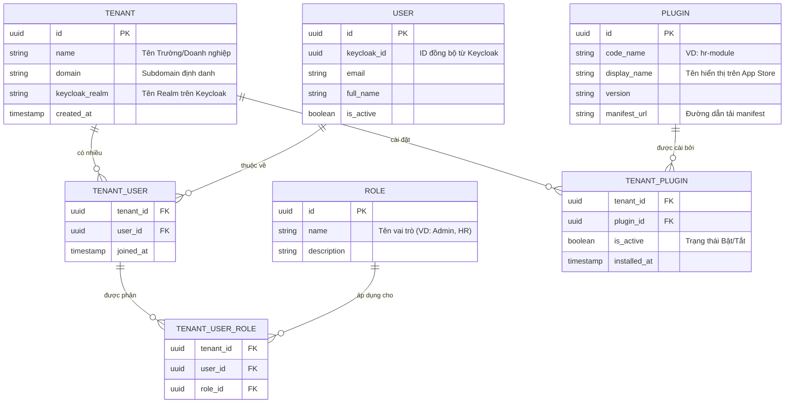

# Lược đồ Dữ liệu Cốt lõi (Core ERD) - Proteus OS

Tài liệu này mô tả Lược đồ Thực thể Liên kết (Entity Relationship Diagram - ERD) cho phần **Proteus OS Base** (Phần lõi hệ điều hành).

Cơ sở dữ liệu này (PostgreSQL) không chứa dữ liệu nghiệp vụ của từng phòng ban (như bảng Chấm công, Hóa đơn). Thay vào đó, nó quản lý lớp **Siêu dữ liệu (Metadata)** bao gồm: Đa khách hàng (Tenants), Người dùng (Users), Phân quyền (Roles) và Quản lý Ứng dụng (Plugins). Dữ liệu nghiệp vụ sẽ do các file `seed_data.sql` của từng Plugin tự tạo bảng riêng rẽ khi được cài đặt.

## 1. Sơ đồ Thực thể (Mermaid Diagram)

Dưới đây là sơ đồ kiến trúc các bảng lõi của hệ thống:

## 2. Diễn giải các Bảng (Tables Description)

### 2.1. Nhóm Quản lý Đa khách hàng & Người dùng (Multi-Tenancy & Identity)
- **Bảng `TENANT`:** Trái tim của kiến trúc Multi-Tenancy. Mỗi khách hàng mua SaaS sẽ có một bản ghi ở đây. Cột `keycloak_realm` dùng để trỏ tới vách ngăn tương ứng bên trong Keycloak.
- **Bảng `USER`:** Lưu trữ thông tin cơ bản của người dùng. Mật khẩu không được lưu ở đây mà do Keycloak quản lý. Cột `keycloak_id` dùng làm cầu nối để đồng bộ trạng thái khi đăng nhập (SSO).
- **Bảng `TENANT_USER` (Bảng trung gian):** Giải quyết bài toán một người dùng có thể thuộc nhiều tổ chức (Ví dụ: Một chuyên gia tư vấn tham gia vào hệ thống của nhiều công ty khác nhau).

### 2.2. Nhóm Quản lý Phân quyền (RBAC)
- **Bảng `ROLE`:** Danh mục các Vai trò cốt lõi.
- **Bảng `TENANT_USER_ROLE`:** Xác định cụ thể người dùng X trong tổ chức Y thì có vai trò Z. (Ví dụ: Nguyễn Văn A là `Admin` ở Công ty B, nhưng chỉ là `Guest` ở Công ty C). Bảng này là căn cứ để chặn/mở quyền ở API Gateway.

### 2.3. Nhóm Quản lý Chợ Ứng dụng (Marketplace)
- **Bảng `PLUGIN`:** Chứa danh sách các gói mở rộng hiện có trên App Store của Proteus OS (như HR, Finance, CRM).
- **Bảng `TENANT_PLUGIN`:** Ghi nhận tổ chức (Tenant) nào đã bấm nút "Install" ứng dụng nào. Khi truy cập Launchpad, Frontend (Next.js) sẽ `SELECT` từ bảng này để biết phải vẽ ra màn hình những Icon ứng dụng nào cho tổ chức đó.

## 3. Liên kết với Dữ liệu Nghiệp vụ của Plugin
Khi Tenant cài đặt Plugin `hr-module`, hệ thống sẽ tự động sinh ra các bảng nghiệp vụ (như `hr_employees`, `hr_leave_requests`) và **tự động thêm cột `tenant_id` (Khóa ngoại)** vào các bảng đó để đảm bảo áp dụng chính sách bảo mật Row-Level Security (RLS).
