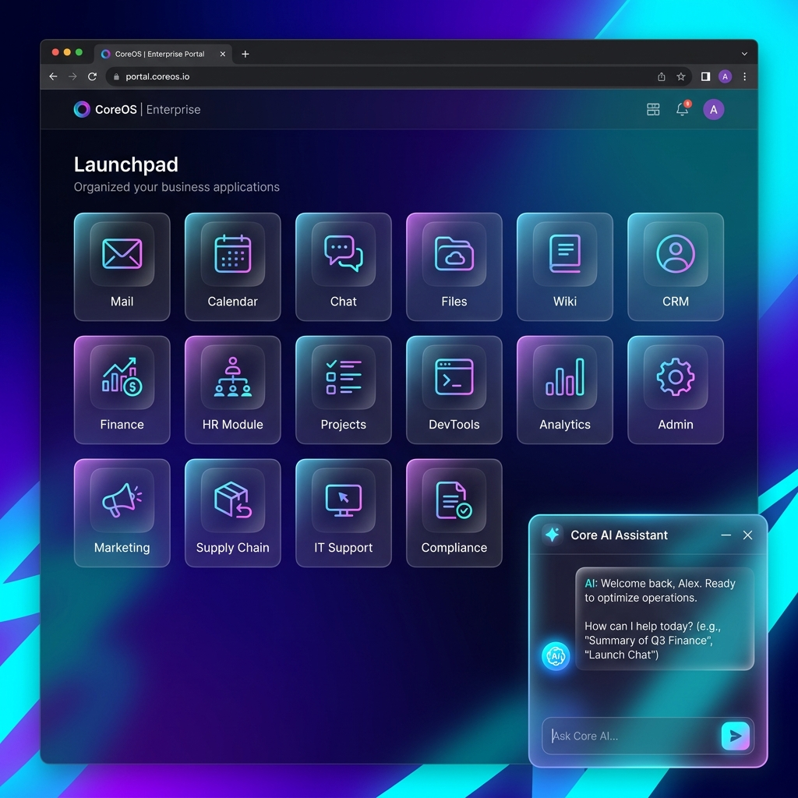
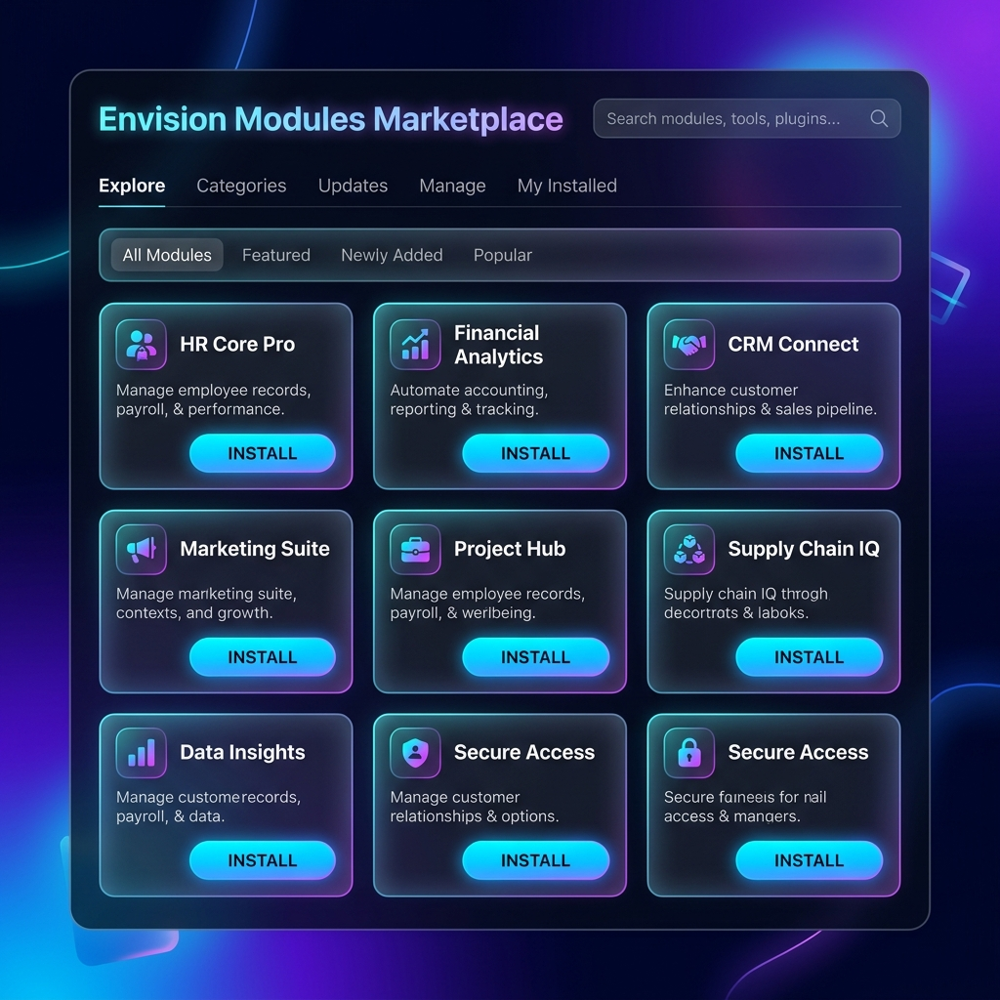
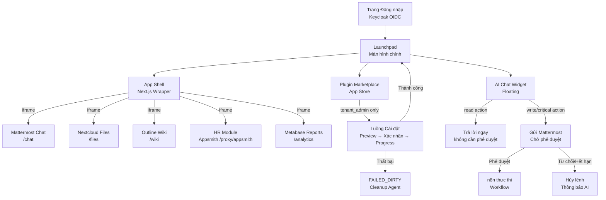

# Ý tưởng Thiết kế Giao diện (UI/UX) cho Proteus OS

Để Proteus OS thực sự mang tầm vóc của một "Hệ điều hành Đa năng cho mọi tổ chức" chứ không chỉ là một phần mềm quản lý thông thường, giao diện người dùng (UI) cần được thiết kế theo hướng **Hiện đại, Tối giản và Tập trung vào trải nghiệm (User-centric)**. 

Dưới đây là mô tả chi tiết và hình ảnh phác thảo (Mockup) cho 2 màn hình quan trọng nhất của hệ thống.

---

## 1. Màn hình Chính (Proteus OS Launchpad)

Thay vì thiết kế theo dạng thanh menu dọc (Sidebar) nhàm chán như các ERP truyền thống, Proteus OS sẽ sử dụng giao diện **Launchpad** (tương tự như màn hình chính của iPad hay macOS).

> [!TIP]
> **Điểm nhấn thiết kế:**
> - **Glassmorphism:** Các icon và panel được thiết kế với hiệu ứng kính mờ (kết hợp CSS `backdrop-filter: blur`), tạo cảm giác không gian đa chiều.
> - **Dark Mode Native:** Tông màu chủ đạo là xanh đen tối bản (Deep Blue/Purple), giúp nhân viên làm việc cả ngày không bị mỏi mắt, đồng thời toát lên vẻ cao cấp "Premium".
> - **Trợ lý AI Thường trực:** Một Widget AI luôn nổi (Floating) ở góc phải màn hình. Giám đốc có thể chat trực tiếp để ra lệnh (Ví dụ: *"Duyệt cho tôi tất cả đơn nghỉ phép hôm nay"*).



---

## 2. Chợ Ứng dụng Nội bộ (Plugin Marketplace)

Đây là nơi Ban Giám đốc hoặc Admin IT truy cập để mở rộng tính năng cho công ty. Màn hình này nằm trong lõi **Innovation Layer** mà đội thi tự code bằng Next.js.

> [!NOTE]
> **Trải nghiệm thao tác (UX):**
> Khi Admin bấm nút **[INSTALL]** ở một thẻ (Card) như *HR Core Pro*, một thanh tiến trình (Progress Bar) sẽ chạy. Phía dưới (Backend), hệ thống đang tự động tải file `manifest.yaml`, đẩy data vào PostgreSQL và gọi n8n tạo Workflow. Sau 30s, cài đặt hoàn tất mà không cần chuyển trang.



---

## 3. Các thành phần UI bên trong Ứng dụng (App UI)

Khi người dùng click vào một Icon trên Launchpad (VD: click vào *Finance*), hệ thống sẽ mở ứng dụng đó ra. Tuy nhiên, để đảm bảo tính đồng nhất (Consistency) về trải nghiệm:

1. **Khung viền chung (App Shell):** Mọi ứng dụng (dù là Appsmith tự thiết kế hay Metabase nhúng vào) đều được bọc trong một khung viền Iframe nội bộ có chứa thanh điều hướng trên cùng (Top Navbar). *(Lưu ý: Để tránh lỗi bảo mật chặn hiển thị Iframe của trình duyệt, toàn bộ các ứng dụng được định tuyến qua Traefik chia sẻ chung một domain gốc bằng phương pháp Single-Domain Path-Based Routing, vd: `proteus.local/chat`, `proteus.local/apps`).*
2. **Nút "Về trang chủ" (Home Button):** Luôn có một nút logo Proteus OS ở góc trên cùng bên trái để nhân viên thoát ứng dụng hiện tại và quay lại màn hình Launchpad một cách mượt mà nhất.
3. **Single Sign-On (Trải nghiệm liền mạch):** Nhờ Keycloak, người dùng khi bấm vào icon Chat (Mattermost) hay Wiki (Outline) sẽ vào thẳng bên trong luôn mà không bao giờ bị hỏi lại mật khẩu.
4. **Trung tâm thông báo (Notification Center):** Tích hợp một "Quả chuông" ở Top Navbar để tổng hợp mọi cảnh báo từ Mattermost, hệ thống duyệt đơn n8n, và Tác tử AI giám sát, giúp người dùng không bỏ lỡ thông tin quan trọng.

---

## 4. Trải nghiệm Đa nền tảng và Trợ năng (Accessibility)

- **Thiết kế Đáp ứng (Mobile Responsiveness):** Cấu trúc lưới (Grid) của Launchpad và giao diện Appsmith/Metabase đều được thiết kế Responsive 100%, đảm bảo Giám đốc có thể xem báo cáo hoặc duyệt đơn trơn tru ngay trên màn hình điện thoại di động (Smartphone/Tablet).
- **Chế độ Sáng/Tối (Light/Dark Mode Toggle):** Dù Dark Mode mang lại vẻ cao cấp, hệ thống vẫn cung cấp nút chuyển đổi sang Light Mode (chế độ nền trắng, chữ đen) để phục vụ cho các nhân sự lớn tuổi hoặc khi làm việc dưới môi trường chói sáng, đáp ứng tiêu chuẩn tiếp cận (a11y) của phần mềm quản trị chuyên nghiệp.

---

## 5. Design System (Hệ thống Thiết kế)

Phần này định nghĩa **Design Tokens** — các giá trị chuẩn hóa toàn bộ giao diện. Developer và Designer phải tuân thủ nghiêm ngặt để đảm bảo tính nhất quán (Consistency) trên toàn bộ hệ thống.

### 5.1. Color Palette (Bảng màu)

#### Dark Mode (Mặc định)

| Token | HSL Value | Hex | Dùng cho |
|---|---|---|---|
| `--color-bg-base` | `hsl(222, 47%, 6%)` | `#060d1f` | Nền trang chính |
| `--color-bg-surface` | `hsl(222, 40%, 10%)` | `#111827` | Nền Card, Panel |
| `--color-bg-glass` | `hsla(222, 40%, 16%, 0.6)` | — | Glassmorphism (backdrop-blur) |
| `--color-bg-hover` | `hsl(222, 35%, 14%)` | `#1a2540` | Hover state trên list item |
| `--color-border` | `hsla(220, 60%, 60%, 0.15)` | — | Viền Card, Divider |
| `--color-primary` | `hsl(245, 85%, 65%)` | `#6c63ff` | Button chính, Active state, Focus ring |
| `--color-primary-hover` | `hsl(245, 85%, 72%)` | `#8880ff` | Hover trên Button chính |
| `--color-accent` | `hsl(280, 80%, 65%)` | `#b44fff` | Badge, Highlight, AI Widget |
| `--color-success` | `hsl(155, 70%, 45%)` | `#22c47a` | Trạng thái ACTIVE, thành công |
| `--color-warning` | `hsl(38, 95%, 55%)` | `#f5a623` | Cảnh báo, INSTALLING |
| `--color-danger` | `hsl(355, 80%, 60%)` | `#f0455a` | Lỗi, FAILED_DIRTY, xóa |
| `--color-text-primary` | `hsl(210, 40%, 96%)` | `#f1f5f9` | Text chính |
| `--color-text-secondary` | `hsl(215, 25%, 65%)` | `#94a3b8` | Text phụ, caption, placeholder |
| `--color-text-disabled` | `hsl(215, 20%, 45%)` | `#5a6880` | Text bị disable |

#### Light Mode (Chuyển đổi)

| Token | HSL Value | Hex | Dùng cho |
|---|---|---|---|
| `--color-bg-base` | `hsl(210, 40%, 98%)` | `#f8fafc` | Nền trang chính |
| `--color-bg-surface` | `hsl(0, 0%, 100%)` | `#ffffff` | Nền Card, Panel |
| `--color-text-primary` | `hsl(222, 47%, 11%)` | `#0f172a` | Text chính |
| `--color-text-secondary` | `hsl(215, 16%, 47%)` | `#64748b` | Text phụ |

### 5.2. Typography System (Kiểu chữ)

**Font Family:**
- **Heading:** `'Inter', 'Plus Jakarta Sans', sans-serif` — Hiện đại, dễ đọc trên màn hình
- **Body:** `'Inter', sans-serif`
- **Monospace (code, ID):** `'JetBrains Mono', 'Fira Code', monospace`

**Thang kích thước (Type Scale):**

| Token | Size | Line Height | Weight | Dùng cho |
|---|---|---|---|---|
| `--text-xs` | `0.75rem / 12px` | `1rem` | 400 | Caption, badge label |
| `--text-sm` | `0.875rem / 14px` | `1.25rem` | 400 | Body nhỏ, meta text |
| `--text-base` | `1rem / 16px` | `1.5rem` | 400 | Body chính |
| `--text-lg` | `1.125rem / 18px` | `1.75rem` | 500 | Card title, section label |
| `--text-xl` | `1.25rem / 20px` | `1.75rem` | 600 | Panel heading |
| `--text-2xl` | `1.5rem / 24px` | `2rem` | 700 | Page title |
| `--text-3xl` | `1.875rem / 30px` | `2.25rem` | 700 | Hero heading |

### 5.3. Spacing & Grid System

**Spacing Scale (dựa trên base 4px):**

| Token | Value | Dùng cho |
|---|---|---|
| `--space-1` | `4px` | Khoảng cách nội bộ icon |
| `--space-2` | `8px` | Gap giữa icon và label |
| `--space-3` | `12px` | Padding nội bộ nhỏ |
| `--space-4` | `16px` | Padding Card, gap row |
| `--space-6` | `24px` | Padding section |
| `--space-8` | `32px` | Margin giữa các block |
| `--space-12` | `48px` | Padding trang chính |
| `--space-16` | `64px` | Gap lớn, hero section |

**Grid Layout:**
- **Launchpad:** `grid-template-columns: repeat(auto-fill, minmax(120px, 1fr))` — Tự động co giãn theo màn hình
- **Marketplace:** 3 cột trên Desktop, 2 cột trên Tablet, 1 cột trên Mobile
- **App Shell:** `grid-template-rows: 56px 1fr` — Navbar cố định 56px, nội dung chiếm phần còn lại

### 5.4. Component Inventory (Danh mục Components)

#### 5.4.1. Button

| Variant | Dùng khi | CSS class |
|---|---|---|
| `primary` | Hành động chính (Install, Save, Approve) | `.btn-primary` |
| `secondary` | Hành động thứ cấp (Cancel, View Details) | `.btn-secondary` |
| `danger` | Hành động nguy hiểm (Uninstall, Delete) | `.btn-danger` |
| `ghost` | Hành động tối giản trong list (Edit, Rename) | `.btn-ghost` |
| `icon` | Chỉ có icon, không có text (Close, Settings) | `.btn-icon` |

**States cho mỗi variant:** `default` → `hover` → `focus` (focus-visible ring) → `active` → `loading` (spinner) → `disabled`

#### 5.4.2. Plugin Card (Marketplace)

```
┌─────────────────────────────────┐
│  [Icon 48px]   HR Module v2.1   │  ← Card Header
│                ⭐ Official        │
├─────────────────────────────────┤
│  Quản lý nhân sự toàn diện:     │  ← Description (2 dòng max)
│  chấm công, nghỉ phép, lương.   │
├─────────────────────────────────┤
│  📦 5 tables  🔄 3 workflows    │  ← Stats
│  👤 hr_manager, leave_approver  │  ← Required roles
├─────────────────────────────────┤
│  [INSTALL]         v2.1 ↑ v2.0  │  ← Action area
└─────────────────────────────────┘
```

**Card States:**
- `available` — Nút INSTALL màu primary
- `installing` — Progress bar chạy, nút disabled
- `active` — Nút "OPEN" màu success, badge "Đã cài"
- `update_available` — Nút "UPDATE" màu warning
- `failed` — Badge "FAILED" màu danger, nút "RETRY"
- `disabled` — Opacity 0.6, nút "ENABLE"

#### 5.4.3. App Icon (Launchpad)

```
     ┌──────────┐
     │          │  ← 80x80px, border-radius: 20px
     │  [Icon]  │  ← Glassmorphism background
     │          │  ← Hover: scale(1.08) + glow shadow
     └──────────┘
      App Name       ← text-sm, text-center, max 2 dòng
      [● ACTIVE]     ← Chỉ hiện khi installed
```

#### 5.4.4. Toast Notification

| Type | Màu | Icon | Vị trí |
|---|---|---|---|
| `success` | `--color-success` | ✅ | Top-right, slide-in |
| `error` | `--color-danger` | ❌ | Top-right, slide-in |
| `warning` | `--color-warning` | ⚠️ | Top-right, slide-in |
| `info` | `--color-primary` | ℹ️ | Top-right, slide-in |

Auto-dismiss sau 5 giây. Click để dismiss sớm.

#### 5.4.5. AI Chat Widget (Floating)

```
                              ┌─────────────────────┐
                              │ 🤖 Proteus AI        │ ← Header
                              │─────────────────────│
                              │ Xin chào! Tôi có    │
                              │ thể giúp gì?        │ ← Message bubble
                              │─────────────────────│
                              │ [Nhập lệnh...]  [➤] │ ← Input
                              └─────────────────────┘
[🤖]  ←── Floating button (64px, bottom-right: 24px)
```

**AI Widget States:**
- `collapsed` — Chỉ hiện floating button
- `expanded` — Chat panel 360x480px
- `thinking` — Typing indicator (3 chấm nhảy)
- `awaiting_approval` — Hiện DSL preview + nút "Phê duyệt trên Mattermost"

#### 5.4.6. Loading & Empty States

| State | Mô tả |
|---|---|
| **Skeleton Loading** | Placeholder shimmer animation cho Card khi đang tải dữ liệu |
| **Spinner** | Inline spinner cho Button loading |
| **Empty Marketplace** | Illustration + text "Chưa có plugin nào. Liên hệ Admin để cài đặt." |
| **Empty Launchpad** | Illustration + text "Workspace trống. Admin hãy cài Plugin đầu tiên." |
| **Error State** | Icon lỗi + message + nút "Thử lại" |

### 5.5. Navigation Flow Diagram



### 5.6. Animation & Motion

| Interaction | Animation | Duration | Easing |
|---|---|---|---|
| Page transition | Fade + slide-up | 200ms | `ease-out` |
| Card hover | scale(1.02) + box-shadow | 150ms | `ease-in-out` |
| App icon hover | scale(1.08) + glow | 200ms | `spring(1, 80, 10)` |
| Modal open | Fade-in + scale(0.95→1) | 250ms | `ease-out` |
| Toast appear | Slide-in-right | 300ms | `ease-out` |
| Progress bar | Linear fill | Theo thực tế | Linear |
| AI thinking dots | Bounce loop | 600ms | `ease-in-out` |
| Skeleton shimmer | Horizontal sweep | 1500ms | Linear (loop) |

> [!TIP]
> **Nguyên tắc Motion:** Giảm animation với người dùng bật `prefers-reduced-motion`. Dùng CSS `@media (prefers-reduced-motion: reduce)` để tắt các hiệu ứng không cần thiết.

